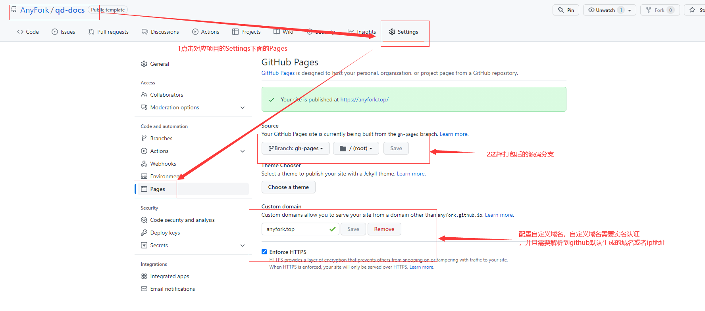

# BLOG-DOCS

> 博客项目采用 vuePress2.X 版本进行构建，以本地主题继承 vuepress2.X 默认主题方式进行开发。集成了部分插件，丰富首页功能。围绕 markdown 语法进行文档编写，记录日常工作中的文档资料，最终项目以 html 静态文件形式进行部署。

- 仓库地址：https://github.com/AnyFork/blog-docs.git
- vuePress 官网地址：https://v2.vuepress.vuejs.org/zh/
- Github 访问地址：https://anyfork.github.io/blog-docs/
- Gitee 访问地址：https://anyfork.gitee.io/blog-docs/

## 项目启动

```bash
#拉取代码
git clone -b main https://github.com/AnyFork/blog-docs.git

# 安装依赖包
npm install

# 运行dev
npm run dev

# 打包
npm run build
```

## 项目部署

> 通过 github actions 进行持续集成部署，静态页面部署在 github pages, 并主动推动至 Gitee 进行自动部署。

- 第一步：项目根目录创建文件夹".github/workflows/deploy.yml",配置如下：

```bash
name: Build and Deploy to github & gitee
on:
  push:
    branches:
      - main
jobs:
  build-and-deploy:
    runs-on: ubuntu-latest
    steps:
      # 构建Node环境
      - name: Build Node.js Env
        uses: actions/setup-node@v1
        with:
          node-version: '16'
      # 检出main分支代码
      - name: Checkout Code
        uses: actions/checkout@v2.3.1
        with:
          persist-credentials: false
      # 安装依赖
      - name: Install dependencies
        run: npm install
      # 项目打包
      - name: Build Project
        run: npm run build
      # github 部署分支gh-pages 到github pages
      - name: Deploy dist on gh-pages
        uses: JamesIves/github-pages-deploy-action@4.2.0
        with:
          BRANCH: gh-pages
          FOLDER: dist
          ACCESS_TOKEN: ${{ secrets.ACCESS_TOKEN }}

      # 同步github代码到gitee
      - name: Sync to Gitee
        uses: wearerequired/git-mirror-action@master
        env:
          # 注意在 Settings->Secrets 配置 GITEE_RSA_PRIVATE_KEY
          SSH_PRIVATE_KEY: ${{ secrets.GITEE_RSA_PRIVATE_KEY }}
        with:
          # 注意替换为你的 GitHub 源仓库地址
          source-repo: git@github.com:AnyFork/blog-docs.git
          # 注意替换为你的 Gitee 目标仓库地址
          destination-repo: git@gitee.com:AnyFork/blog-docs.git

      # 自动部署gitee gh-pages分支
      - name: Build Gitee Pages
        uses: yanglbme/gitee-pages-action@main
        with:
          # 注意替换为你的 Gitee 用户名
          gitee-username: 874957743@qq.com
          # 注意在 Settings->Secrets 配置 GITEE_PASSWORD
          gitee-password: ${{ secrets.GITEE_PASSWORD }}
          # 注意替换为你的 Gitee 仓库，仓库名严格区分大小写，请准确填写，否则会出错
          gitee-repo: AnyFork/blog-docs
          # 要部署的分支，默认是 master，若是其他分支，则需要指定（指定的分支必须存在）
          branch: gh-pages

```

本地代码通过 push 提交远程 github 上的 main 分支，触发 jobs,分为 3 个 steps,拉取代码，安装依赖和打包，配置代理。打包后的 dist 文件在 gh-pages 分支上。然后自动推送至 Gitee，实现 Gitee 自动同步部署更新。

- 第二步：配置 github pages. 具体步骤如下：



- 第三步：每次提交代码至github均会触发Action，工作流执行完毕时，会实现GitHub和Gitee自动同步部署更新。
